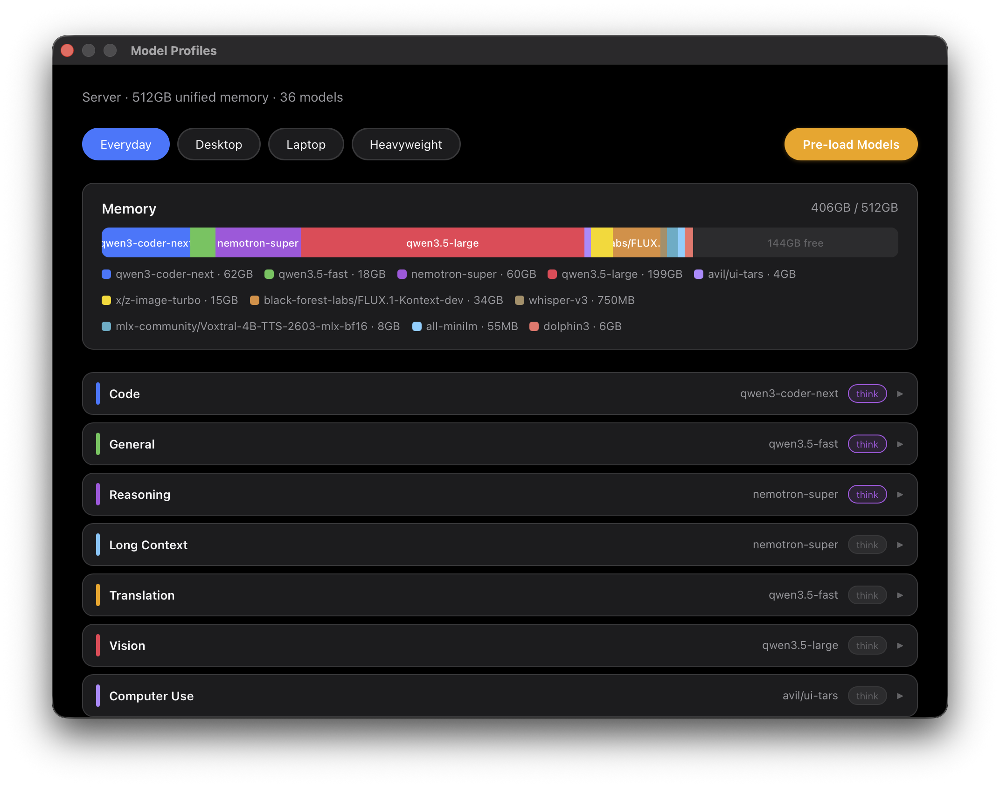
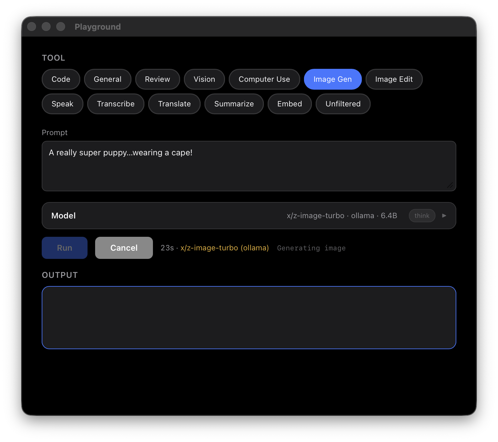

# Super Puppy

> **Requires Apple Silicon Mac** (M1 or later) with 64GB+ unified memory. macOS only.

Cloud AI providers are tightening what you can do with a subscription. Anthropic just [cut off third-party tool access](https://news.ycombinator.com/item?id=47633396) from Claude subscriptions. OpenAI has rate-limited power users before them. The pattern is clear: if your workflow depends on someone else's capacity, your workflow is at their mercy.

Your Mac has a GPU that can run serious AI models — probably while it's sitting idle. Super Puppy turns it into a managed local model server: LLMs, vision, image and video generation, transcription, translation, text-to-speech, embeddings. Controlled from the menu bar, accessible over standard APIs, available to any tool on your network. No one can throttle it, reprice it, or take it away.

It works as a **server** or a **client** — and every client is also a server. Install it on a beefy desktop and it serves models over Tailscale. Install it on a laptop and it auto-discovers the desktop, routing requests to the bigger machine's GPU. When the desktop is unreachable — you're on a plane, at a coffee shop, whatever — the same tools keep working against local models on the laptop itself. Your code, your scripts, your Claude Code workflows never have to care which machine is doing the work. They hit the same APIs either way; Super Puppy handles the routing.

No cloud, no per-token billing — inference is fully local. Write against local AI APIs once, get the best available hardware transparently. (Initial model downloads and auto-update checks do require network access; see [Network Transparency](#network-transparency).)

Super Puppy is **not** a training or fine-tuning platform, a cloud service, or a production deployment tool. It's for people who want to run inference on hardware they own — for development, experimentation, creative work, and daily use. You need enough unified memory for the models you care about: 64GB gets you started, 128GB+ handles most things, 256GB+ runs everything.

<p align="center"></p>

## Quick Start

**Prerequisites:** Xcode Command Line Tools (provides `git`), Homebrew.

```bash
xcode-select --install      # if git is not installed
/bin/bash -c "$(curl -fsSL https://raw.githubusercontent.com/Homebrew/install/HEAD/install.sh)"  # if brew is not installed

git clone https://github.com/jerrytalton/super-puppy.git ~/super-puppy
cd ~/super-puppy
./install.sh
```

The installer walks you through everything: server vs. client role, network config, auth tokens, Tailscale for remote access, and which models to pull. Then:

```bash
start-local-models
```

## What You Get

### Standard APIs

Once Super Puppy is running, any application that speaks OpenAI or Ollama can use your local models.

**Ollama API** (port 11434) — chat, generation, embeddings:

```bash
curl http://localhost:11434/api/generate -d '{"model":"qwen3.5","prompt":"hello"}'

curl http://localhost:11434/api/chat -d '{
  "model": "qwen3.5",
  "messages": [{"role":"user","content":"explain quicksort"}]
}'

curl http://localhost:11434/api/embed -d '{"model":"all-minilm","input":"search query"}'
```

**OpenAI-compatible API** (port 8000) — MLX models via the standard OpenAI client:

```python
from openai import OpenAI

client = OpenAI(base_url="http://localhost:8000/v1", api_key="unused")

response = client.chat.completions.create(
    model="qwen3.5-fast",
    messages=[{"role": "user", "content": "hello"}],
)

# Vision
response = client.chat.completions.create(
    model="qwen3.5-fast",
    messages=[{
        "role": "user",
        "content": [
            {"type": "text", "text": "What's in this image?"},
            {"type": "image_url", "image_url": {"url": "file:///path/to/image.png"}},
        ],
    }],
)
```

```bash
curl http://localhost:8000/v1/chat/completions -H "Content-Type: application/json" -d '{
  "model": "qwen3.5-fast",
  "messages": [{"role":"user","content":"hello"}]
}'

curl http://localhost:8000/v1/models
```

On the 512GB tier, glm-5.2 is served by [ds4](https://github.com/antirez/ds4) with the same OpenAI-compatible API on port 8002 (localhost only):

```bash
curl http://localhost:8002/v1/chat/completions -H "Content-Type: application/json" -d '{
  "model": "glm-5.2",
  "messages": [{"role":"user","content":"hello"}]
}'
```

### Playground

The menu bar app serves a web-based Playground where you can test any capability interactively — text generation, vision, image generation, transcription, TTS, translation. Open it from the Super Puppy menu or access it from other devices on your network. With Tailscale configured, the Playground is accessible from anywhere over HTTPS.

<p align="center"></p>

The Playground is a PWA — on iOS or iPadOS, open it in Safari and tap "Add to Home Screen" to install it as a standalone app. On Android, Chrome will prompt you to install it. Your phone becomes a frontend to your desktop's GPU.

### MCP Tools for Claude Code

If you use Claude Code, Super Puppy exposes all of its capabilities as MCP tools that Claude can call mid-conversation. Claude keeps doing what it's best at — architecture, debugging, complex reasoning — and offloads everything else to your hardware.

| Tool | What it does |
|------|-------------|
| `local_generate` | Code and text generation — auto-selects a coder or generalist |
| `local_review` | Second opinion on code from a different model architecture |
| `local_vision` | Analyze images on disk with a local vision model |
| `local_computer_use` | Plan GUI actions from a screenshot (observe only, no execution) |
| `local_image` | Generate images locally with a diffusion model |
| `local_image_edit` | Edit an existing image with a text prompt |
| `local_video` | Generate video locally (Wan2.2 / LTX-2), optionally with synced audio |
| `local_transcribe` | Audio to text |
| `local_speak` | Text to speech with voice presets or voice cloning |
| `local_translate` | Translate text or files |
| `local_candidates` | Run the same prompt against multiple models in parallel |
| `local_summarize` | Condense large files before reading them in full |
| `local_embed` | Generate embeddings for semantic search or clustering |
| `local_similarity_search` | Find files most related to a concept |
| `local_dispatch` / `local_collect` | Run a model in the background, collect results later |
| `local_models_status` | List available models and their capabilities |

You control which model backs each task from the menu bar app. Pull a new model and it's immediately available.

## Server and Client

The installer asks whether this machine is the model server or a client. The server runs models locally and serves them over Tailscale. Clients auto-discover the server and route requests to it:

| Environment | What happens |
|-------------|-------------|
| **Server** | All models run locally. Tailscale exposes APIs to clients. |
| **Client (server reachable)** | Routes to server via Tailscale. |
| **Client (server unreachable)** | Falls back to local models. |

All remote access uses Tailscale — services bind to localhost and are proxied with automatic TLS. Both the MCP server and the Playground require bearer token authentication for remote requests. Re-run `./install.sh --reconfigure` to change the role or server hostname.

## Menu Bar App

A puppy icon in the menu bar provides:

- **Status** — Ollama/MLX/ds4 running or down, MCP configured or not
- **Model Profiles** — RAM-tier presets (32GB / 64GB / 128GB / 512GB) with a warm-set memory view
- **Task preferences** — pick which model backs each MCP tool
- **Playground** — web UI to test any tool interactively
- **Remote Access** — toggle Tailscale-based remote access to the Playground
- **Auto-update** — pulls new tagged releases automatically
- **Activity Log / Fleet view** — per-machine usage stats and a config-health audit (`sp-doctor`) across every machine on your fleet, never leaving your own tailnet — see [docs/usage-telemetry.md](docs/usage-telemetry.md)

## Commands

```bash
start-local-models            # start Ollama + MLX (+ ds4 on the 512GB tier)
start-local-models --status   # show what's running
start-local-models --stop     # stop servers
start-local-models --local    # force local servers even if server is reachable
tailscale-status              # check Tailscale connectivity and FQDN

./install.sh --reconfigure    # re-run interactive setup
./install.sh --rotate-token   # refresh the MCP auth token
./uninstall.sh                # remove Super Puppy (keeps dependencies, see script for details)
```

## Adding a New Model

**Ollama**: Just pull it. It's immediately available as an API endpoint and MCP tool.
```bash
ollama pull some-new-model
```

**MLX**: Find a model on [MLX Community](https://huggingface.co/mlx-community) (pre-quantized MLX weights), download it, add it to your config, and restart:
```bash
hf download mlx-community/Some-Model-4bit
```
Then add an entry to `~/.config/mlx-server/config.yaml`:
```yaml
  - model_path: mlx-community/Some-Model-4bit
    model_type: lm           # lm, multimodal, whisper, image-generation, image-edit
    served_model_name: my-model
    context_length: 8192
    on_demand: true
    on_demand_idle_timeout: 300
```
```bash
pkill -f mlx-openai-server
start-local-models
```

You can skip the `hf download` — models with `on_demand: true` download automatically on first use. Pre-downloading avoids the wait.

Your custom models survive auto-updates. When a new release adds default models, they're merged into your config automatically (existing entries are never modified or removed).


## Optional Dependencies

The installer handles core dependencies (uv, Ollama, MLX). These optional tools enable additional capabilities:

| Dependency | For | Install |
|-----------|-----|---------|
| **mflux** | Image generation (`local_image`) and editing (`local_image_edit`) | `uv tool install --python 3.12 mflux` |
| **ffmpeg** | Audio transcription of WebM, MP3, and other formats | `brew install ffmpeg` |

The installer installs both automatically on machines with 32GB+ RAM and Homebrew available. If you skipped them or installed Super Puppy before this was added, install manually with the commands above.

### HuggingFace authentication

Before downloading models, the installer ensures you're authenticated to HuggingFace — some repos are gated (e.g. FLUX) and auth also avoids anonymous rate limits. Resolution order:

1. An existing `hf auth login` → used as-is.
2. The standard `HF_TOKEN` environment variable → logged in non-interactively (CI / `curl` installs).
3. An interactive terminal → prompts you to log in once (`hf auth login`).
4. Otherwise (non-interactive, no token) → warns and downloads anonymously; gated repos will 401.

## Network Transparency

All inference runs locally — model input and output never leave your machine. However, Super Puppy does make network calls in these cases:

- **Auto-update**: Polls GitHub for new git tags every 2 minutes. Disable with `AUTO_UPDATE=false` in `~/.config/local-models/network.conf`.
- **Model downloads**: First use of HuggingFace embedding models (bge-m3, e5-small-v2) downloads from huggingface.co. Subsequent uses are cached locally.
- **Tailscale**: Remote access uses Tailscale's relay network when direct connections aren't possible.

## Configuration

All user-writable config lives in `~/.config/local-models/`. The installer sets these up interactively.

### Profiles

Profiles are keyed to the machine class they target — the installer picks one by RAM, and you can change it any time from Model Profiles. Each tier runs the best models its **RAM and GPU** can drive with headroom: weaker-GPU tiers favor fast low-active-param MoE models, stronger tiers run dense models at higher precision, and the top tier runs frontier.

| Tier | Workhorse (general/reason/long-ctx/translate) | Code | Vision | Notable |
|------|-----------------------------------------------|------|--------|---------|
| **32GB** | `qwen3.5-9b` (small, fast) | (reuse) | `qwen3.6:27b` | embeddinggemma, Voxtral TTS, light image gen |
| **64GB** | `qwen3.6:27b-mlx` (dense, MLX) | `qwen3.6:27b-coding-mxfp8` | `qwen3.6:27b` | + computer-use, Voxtral TTS |
| **128GB** | `qwen3.6:27b-mlx-bf16` (dense bf16) | `qwen3-coder-next` | `qwen3.6:27b` | + image edit, video |
| **512GB** | `glm-5.2` (frontier)\* | `qwen3-coder-next` | `qwen3.6:27b` | full multimedia stack |

A 256GB machine runs the `128gb` tier; a 512GB machine runs `512gb`.

\* glm-5.2 is served by [ds4](https://github.com/antirez/ds4) (pinned
build, provisioned by `install.sh` on 512GB machines) from a ~244GiB Q2K
GGUF — always resident, OpenAI-compatible on localhost:8002. See
[docs/troubleshooting.md](docs/troubleshooting.md) for build/run details.

#### Warm vs on-demand

Each profile declares a **warm set** (the text workhorse + embedding) that's kept resident for instant task-switching; everything else streams on demand and unloads when idle. On Apple Silicon the GPU is time-sliced — keeping many models resident buys no concurrency and risks memory-pressure thrash — so the warm set is deliberately small (≤ ~65% of RAM, leaving room for the active model's KV cache and the OS). The Models page's memory bar shows the warm set against that budget, with the largest on-demand model as a hatched "transient peak."

Warm models are re-pinged every 4 minutes, residency-first: refreshes only
touch models that are already loaded. If a warm model was evicted, SP re-loads
it only when the machine is quiet — nothing in flight, no foreign models
resident, normal memory pressure, and enough available memory for the model
plus headroom. Warm residency exists to hide cold starts on an idle machine;
under contention it lapses instead of competing.

| File | What |
|------|------|
| `network.conf` | Server role, hostname, ports, auth, Tailscale |
| `mcp_preferences.json` | Which model backs each MCP task type |
| `profiles.json` | Model profiles (managed by the menu bar app) |
| `mcp_auth_token` | Cached MCP bearer token (600 permissions) |

### MLX Models

Edit `~/.config/mlx-server/config.yaml`. Every model is `on_demand: true` (loads when first requested, unloads after an idle timeout) — the active profile decides what's actually pulled and kept warm, so one config serves all tiers. Use `model_type: multimodal` for vision models. Your edits persist across auto-updates. One exception: the retired glm-5.2 MLX entry is removed once on 512GB machines by the ds4 migration (it moved to the ds4 backend).


## CLAUDE.md Setup

The MCP tools work automatically once installed, but Claude Code performs better when it knows what's available. The installer checks for a `## Local Model Cluster` section in `~/.claude/CLAUDE.md` and offers to add one. This tells Claude when and how to use each tool. See the installer output for the recommended snippet, or check `~/.claude/CLAUDE.md` if it's already configured.

## Structure

```
super-puppy/
├── app/
│   ├── menubar.py               # Menu bar app (PEP 723, rumps)
│   ├── profile-server.py        # Profiles + Playground web UI
│   ├── super-puppy.c            # Native launcher for macOS app bundle
│   ├── SuperPuppy.app/          # macOS app bundle (built by install.sh)
│   ├── tools.html               # Playground interface
│   ├── profiles.html            # Model profiles interface
│   └── activity.html            # Activity monitor interface
├── mcp/
│   └── local-models-server.py   # MCP server (PEP 723, runs via uv)
├── bin/
│   ├── start-local-models       # Service manager
│   ├── local-models-menubar     # App launcher
│   ├── local-models-mcp-detect  # MCP wrapper with Tailscale discovery
│   ├── local-models-mcp-auth    # MCP auth token management
│   ├── tailscale-status         # Tailscale connectivity check
│   ├── post-update.sh           # Post-update hook for auto-update
│   ├── migrate-mlx-config.py    # One-shot user-config migration (glm-5.2 → ds4)
│   └── release.sh               # Cut a gated, signed release (see docs/RELEASING.md)
├── config/
│   ├── mlx-server/              # MLX server config (single, on-demand)
│   ├── local-models/            # Network config, preferences
│   └── launchd/                 # LaunchAgent plists
├── lib/
│   ├── models.py                # Shared model constants
│   └── hf_scanner.py            # HuggingFace model discovery
├── tests/                       # pytest unit, e2e, and cross-version fleet-compat tests
├── web/                         # Marketing site
├── docs/                        # Setup docs, RELEASING.md, and design specs/plans
├── install.sh                   # Interactive installer
├── uninstall.sh                 # Clean removal (keeps deps and models)
└── LICENSE                      # GPLv3
```

## License

GPLv3. See [LICENSE](LICENSE).
